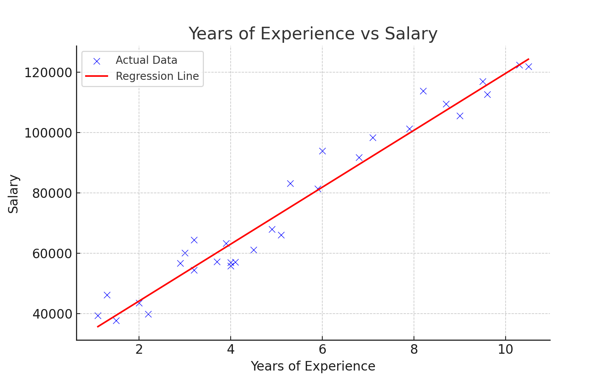

# 🧠 Employee Salary Prediction

A simple yet powerful Machine Learning project that predicts employee salaries based on years of experience using Linear Regression.

## 🚀 Project Overview

This project demonstrates how to:
- Use Python and Scikit-learn for regression analysis
- Train and evaluate a model on real-world salary data
- Visualize relationships and predictions using Matplotlib & Seaborn

## 📊 Tools & Libraries
- Python
- Pandas, NumPy
- Matplotlib, Seaborn
- Scikit-learn (LinearRegression)

## 🔧 How It Works
1. Load and explore the dataset
2. Visualize data trends
3. Split into train/test sets
4. Train a Linear Regression model
5. Evaluate model using R² and MAE
6. Predict salary for given experience

## 📷 Sample Output

  
*Regression Line: Salary vs Experience*

## 📁 Files
- `Employee_Salary_Prediction.ipynb` – Complete notebook
- `prediction_plot.png`, `bar_plot.png` – Visual outputs

## 👤 Author
**Irfan Riyaz**  

